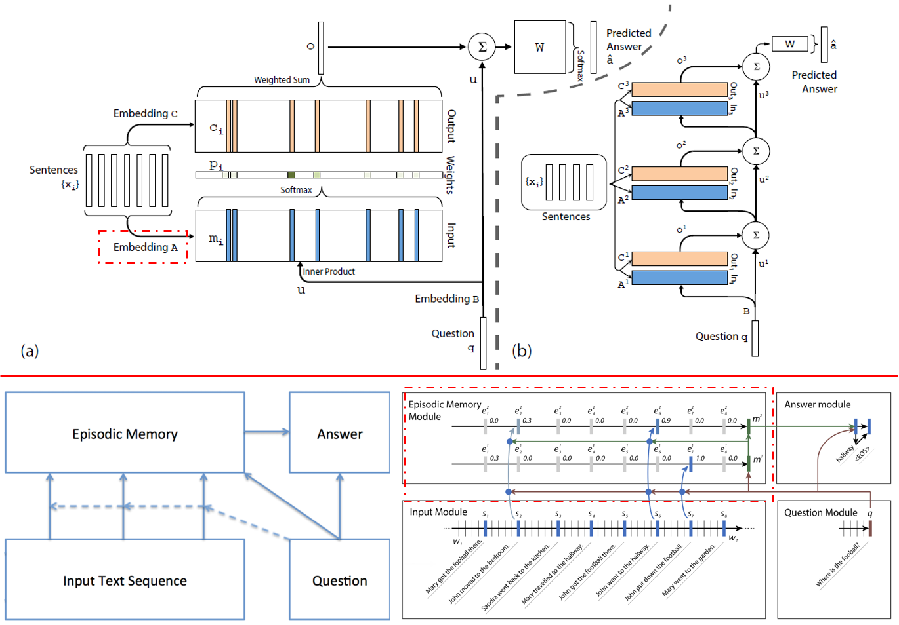

# Paper-Reading-Third-Edition

eg: 0-ACL16-Ng-Paper_title.pdf
- Abstract
  - Overview:
  - Advantage:
  - Disadvantage:
  - What can I do? / Can I employ its idea?
- Experiments
  - DataSet:
  - Toolkit:
  - Baseline:
  - Result:

## 1-ICML16-Socher-Ask Me Anything Dynamic Memory Networks for Natural Language Processing
  [PDF](https://arxiv.org/abs/1506.07285),
  [!Bib](http://dblp.uni-trier.de/rec/bibtex/journals/corr/KumarISBEPOGS15)
  [Implement Blog](https://yerevann.github.io/2016/02/05/implementing-dynamic-memory-networks/)
  - [**Experiment Tasks and Datasets**]
    - Reading Comprehension (**bAbI**)
    - Sentiment Classification (**Stanford Sentiment TreeBank**)
    - Sequence Modeling - POS tagging (**WSJ-PTB**)
  - [**Model**]
    - **Input Module**
    - **Question Module**
    - **Episodic Memory Module**
    - **Answer Module**
   
  - [**Dynamic Memory Networks V.S. Memory Networks**]
    1. Sentence Encoding: RNN, Position-Encoding
    2. Dynamic: Episodic Memory Module(When attention probbility is in the <EOS> position), Multi-Hops
  - [**Motivation for Memory Module**]:
    > **Episodic Memory Module**: Given a collection of input representations, the episodic memory module chooses which parts of the inputs to focus on through the attention mechanism. It then produces a ”memory” vector representation taking into account the question as well as the previous memory. Each iteration provides the module with newly relevant information about the input. In other words, the module has the ability to retrieve new information, in the form of input representations, which were thought to be irrelevant in previous iterations. 
  - [**Motivation for Dynamic Part**]:
    >**Need for Multiple Episodes**: The iterative nature of this module allows it to attend to different inputs during each pass. It also allows for a type of transitive inference, since the first pass may uncover the need to retrieve additional facts. For instance, in the example in Fig. 3, we are asked Where is the football? In the first iteration, the model ought attend to sentence 7 (John put down the football.), as the question asks about the football. Only once the model sees that John is relevant can it reason that the second iteration should retrieve where John was. Similarly, a second pass may help for sentiment analysis as we show in the experiments section below.
 
## 2-ICLR15-Facebook-MEMORY NETWORKS
  [PDF](https://arxiv.org/abs/1410.3916),
  [!Bib](http://dblp.uni-trier.de/rec/bibtex/journals/corr/WestonCB14)
  [ppt](/files/2-icml2016-memnn-tutorial.pptx)
  - [**Motivation**]
    - Class of models that combine large memory with learning component that can read and write to it.
    - Incorporates reasoning with attention over memory (RAM).
    - long-term memory is required to read a story and then e.g. answer questions about it.
  - [**Models**]
  MemNNs have four component networks (which may or may not have shared parameters):
    - **I**: (input feature map) convert incoming data to the internal feature representation.
    - **G**: (generalization) update memories given new input.
    - **O**: produce new output (in feature representation space) given the memories.
    - **R**: (response) convert output O into a response seen by the outside world.
  - [**Some Memory Network- related Publications**]
    - J. Weston, S. Chopra, A. Bordes. Memory Networks. ICLR 2015 (and arXiv:1410.3916).
    - S. Sukhbaatar, A. Szlam, J. Weston, R. Fergus. End-To-End Memory Networks. NIPS 2015 (and arXiv:1503.08895). 
    - J. Weston, A. Bordes, S. Chopra, A. M. Rush, B. van Merriënboer, A. Joulin, T. Mikolov. Towards AI-Complete Question Answering: A Set of Prerequisite Toy Tasks. arXiv:1502.05698. 
    - A. Bordes, N. Usunier, S. Chopra, J. Weston. Large-scale Simple Question Answering with Memory Networks. arXiv:1506.02075. 
    - J. Dodge, A. Gane, X. Zhang, A. Bordes, S. Chopra, A. Miller, A. Szlam, J. Weston. Evaluating Prerequisite Qualities for Learning End-to-End Dialog Systems. arXiv:1511.06931.
    - F. Hill, A. Bordes, S. Chopra, J. Weston. The Goldilocks Principle: Reading Children's Books with Explicit Memory Representations. arXiv:1511.02301.
    - J. Weston. Dialog-based Language Learning. arXiv:1604.06045. 
    - A. Bordes, Jason Weston. Learning End-to-End Goal-Oriented Dialog. arXiv:1605.07683.
  - [**RAM Issues**]
    - How to decide what to write and what not to write in the memory?
    - How to represent knowledge to be stored in memories?
    - Types of memory (arrays, stacks, or stored within weights of model), when they should be used, and how can they be learnt?
    - How to do fast retrieval of relevant knowledge from memories when the scale is huge?
    - How to build hierarchical memories, e.g. multiscale attention?
    - How to build hierarchical reasoning, e.g. composition of functions?
    - How to incorporate forgetting/compression of information?
    - How to evaluate reasoning models? Are artificial tasks a good way? Where do they break down and real tasks are needed?
    - Can we draw inspiration from how animal or human memories work?
  
## 3-Hierachical Memory Networks
  [PDF](https://arxiv.org/abs/1605.07427),
  !Bib
  - [**Abstract**]
  > Memory networks are neural networks with an explicit memory component that can be both read and written to by the network. The memory is often addressed in a soft way using a softmax function, making end-to-end training with backpropagation possible. However, this is not computationally scalable for applications which require the network to read from extremely large memories. On the other hand, it is well known that hard attention mechanisms based on reinforcement learning are challenging to train successfully. In this paper, we explore a form of hierarchical memory network, which can be considered as a hybrid between hard and soft attention memory networks. The memory is organized in a hierarchical structure such that reading from it is done with less computation than soft attention over a flat memory, while also being easier to train than hard attention over a flat memory. Specifically, we propose to incorporate Maximum Inner Product Search (MIPS) in the training and inference procedures for our hierarchical memory network. We explore the use of various state-of-the art approximate MIPS techniques and report results on SimpleQuestions, a challenging large scale factoid question answering task.
  - [**Hierachical Memory Networks**]
    - Memory: Memory cells are organized into groups. (Cluster)
    - Reader: HMN readers user soft attention only over a selected subset of the memory.

## 4-STS-Cross-Lingual Model
   (Aldarmaki and Diab, 2016; Ataman et al., 2016; Bicici 2016; Lo et al., 2016)
  - 1-SemEval16-Aldarmaki and Diab-Matrix Factorization for Crosslingual STS
  - 2-SemEval16-Ataman-Cross lingual Semantic Similarity Measurement Using Quality Estimation Features and Compositional Bilingual Word Embeddings
  - 3-SemEval16-Bicici-Predicting Semantic Similarity with Referential Translation Machines and Related Statistics
  - 4-SemEval16-Lo-Experiments in Crosslingual Semantic Textual Similarity
  
  - [**Model**]
    - **1. Weighted Matrix Factorization (WMF)**
      - Related Work: 
      	- monolingual weighted matrix factorization(Guo and Diab, 2012)
      	- GloVe(pennington et.al;, 2014), Extend to Bilingual with shared factor(Shi et.al., 2015)
      - Method:
      	- A global bilingual loss function (b-WMF)
      	- a monolingual loss function with explicit shared factor (x-WMF)
      - Notes:
        - How to train? Classic Models
        - How to test? To generate vector representations for additional sentences after training, P is fixed and Q is calculated for the new sentences.
   - **4. Crosslingual Embedding Mapping**
     - Methood:
	 	- flat lexical semantic features:
	 	  - For each word in spanish, find the top 5 sim words in english according embedding which trained with word2vec
	 	  - Average the most sim word with idf weight
	 	- shallow structual semantic features:
	      - MT evaluation metric (Ref: Lo et.al 2014)
     - Notes:
	    - Crosslingual Embedding Mapping < MT + monolingual features 

## 5-arXiv16-Facebook-Key-Value Memory Networks for Directly Reading Documents
## 6-ACL16-BIT-CSE Conceptual Sentence Embeddings based on Attention Model
## 7-ACL16-Stanford-A Fast Unified Model for Parsing and Sentence Understanding
## 8-arXiv16-FDU-Cached Long Short-Term Memory Neural Networks for Document-Level Sentiment Classification